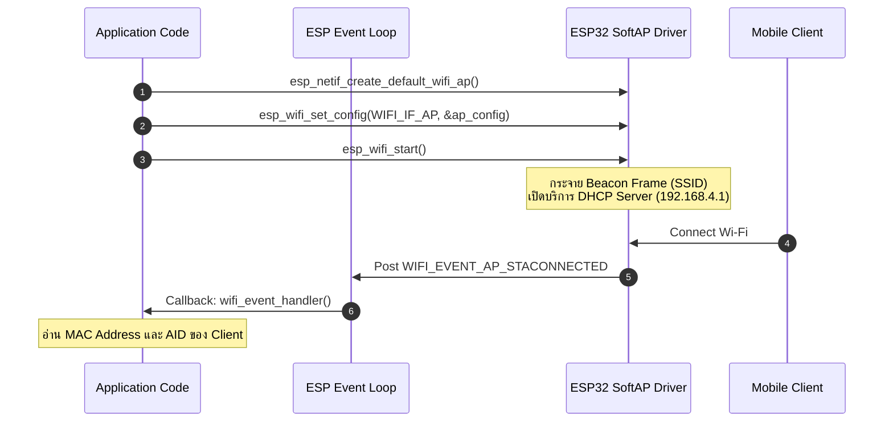
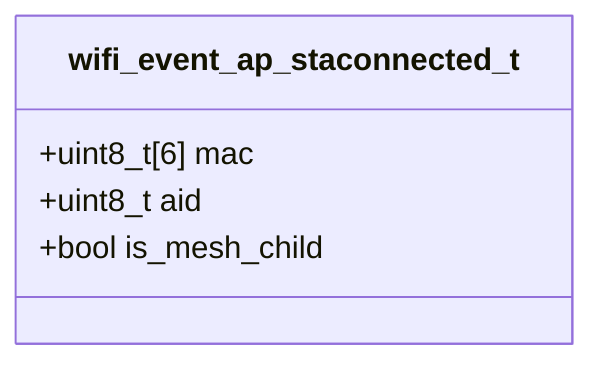

# ใบงานที่ 6.1: การคอนฟิก ESP32 SoftAP และการสกัด Forensic Log ข้อมูล Client (Wi-Fi Access Point Mode)

## 0. กล่าวนำ (Introduction)
ในใบงานนี้ นักศึกษาจะได้สลับบทบาทของ ESP32 จากการเป็นลูกข่าย (Station) มาเป็นผู้ให้บริการจุดเชื่อมต่อไร้สาย **SoftAP (Software Access Point Mode)** ด้วยสถาปัตยกรรม ESP-IDF 

นักศึกษาจะได้เรียนรู้การเปิดบริการ DHCP Server การตั้งค่าโหมดความปลอดภัย WPA2-PSK และดักจับ Forensic Log เมื่อมีอุปกรณ์ลูกข่าย (เช่น สมาร์ตโฟน หรือ ESP32 Station ของเพื่อน) เข้ามาเชื่อมต่อ โดยสกัดข้อมูลในระดับ Link Layer เช่น **MAC Address** และ **Association ID (AID)** จาก Event `WIFI_EVENT_AP_STACONNECTED`

---

## 1. วัตถุประสงค์ (Objectives)
1. สามารถคอนฟิก ESP32 ให้ทำงานในโหมด SoftAP (`WIFI_MODE_AP`) และเปิดบริการ DHCP Server ได้สำเร็จ
2. สามารถใช้ Event Loop ในการดักจับ Event `WIFI_EVENT_AP_STACONNECTED` และ `WIFI_EVENT_AP_STADISCONNECTED`
3. สกัดและวิเคราะห์ข้อมูล MAC Address (BSSID) และ Association ID (AID) ของอุปกรณ์ลูกข่ายที่เข้ามาเชื่อมต่อ
4. เข้าใจกลไกการจำกัดจำนวนการเชื่อมต่อสูงสุด (`max_connection`) บน ESP32

---

## 2. อุปกรณ์และซอฟต์แวร์ที่ใช้ในการทดลอง (Equipment & Tools)
1. บอร์ดไมโครคอนโทรลเลอร์ ESP32 จำนวน 1 บอร์ด
2. สายเชื่อมต่อ Micro-USB หรือ USB-C จำนวน 1 เส้น
3. สมาร์ตโฟน หรือ คอมพิวเตอร์ สำหรับทดสอบเชื่อมต่อ Wi-Fi ที่ ESP32 สร้างขึ้น
4. โปรแกรม IDE เช่น VS Code พร้อม ESP-IDF Toolchain

---

## 3. ความรู้พื้นฐานที่เกี่ยวข้อง (Theoretical Background)

### 3.1 สถาปัตยกรรม Event และ DHCP Server ในโหมด SoftAP



### 3.2 โครงสร้างข้อมูล `wifi_event_ap_staconnected_t` (Class Diagram)



---

## 4. ขั้นตอนการทดลอง (Experimental Procedures)

1. สแกนและตั้งชื่อ SSID ของ ESP32 AP เป็นชื่อเฉพาะของตนเอง (เช่น `"ESP32_AP_XXXX"` โดยระบุรหัสนักศึกษา 4 ตัวท้าย)
2. กำหนดรหัสผ่าน Wi-Fi เป็น `"12345678"` (WPA2-PSK) และจำกัดจำนวนการเชื่อมต่อไว้ที่ 4 เครื่อง (`.max_connection = 4`)
3. ทำการ Build และ Flash ซอร์สโค้ดลงบอร์ด ESP32
4. นำสมาร์ตโฟนกดค้นหา Wi-Fi และป้อนรหัสผ่านเพื่อเชื่อมต่อเข้ากับ ESP32 AP
5. สังเกต Forensic Log ใน Serial Monitor และบันทึกค่า MAC Address, AID และ IP Address ที่ ESP32 แจกจ่ายให้

---

## 5. ซอร์สโค้ดการทดลอง (Complete ESP-IDF Source Code - `main.c`)

ดูใน Lab6-1-Wi-Fi-SoftAP\main\main.c

---

## 6. ตารางบันทึกผลการทดลอง (Experiment Results)

### 6.1 บันทึกข้อมูล Client ที่เชื่อมต่อเข้ากับ ESP32 SoftAP

| อุปกรณ์ที่ใช้ทดสอบ (เช่น iPhone/Android) | MAC Address ที่ดักจับได้ | Association ID (AID) | หมายเลข IP Address ที่ได้ (ถ้าทราบ) |
| :--- | :--- | :---: | :---: |
| **อุปกรณ์ที่ 1** |68:CA:C4:13:AF:CA |1 |192.168.4.2 |
| **อุปกรณ์ที่ 2** |D0:4D:86:3B:09:D6 |2 |192.168.4.3 |

Log ที่ได้
~~~
I (29) boot: ESP-IDF v5.5.1 2nd stage bootloader
I (29) boot: compile time Aug 11 2026 09:30:36
I (29) boot: Multicore bootloader
I (31) boot: chip revision: v3.1
I (33) boot.esp32: SPI Speed      : 40MHz
I (37) boot.esp32: SPI Mode       : DIO
I (41) boot.esp32: SPI Flash Size : 2MB
I (44) boot: Enabling RNG early entropy source...
I (49) boot: Partition Table:
I (51) boot: ## Label            Usage          Type ST Offset   Length
I (58) boot:  0 nvs              WiFi data        01 02 00009000 00006000
I (64) boot:  1 phy_init         RF data          01 01 0000f000 00001000
I (71) boot:  2 factory          factory app      00 00 00010000 00100000
I (77) boot: End of partition table
I (81) esp_image: segment 0: paddr=00010020 vaddr=3f400020 size=19a68h (105064) map
I (124) esp_image: segment 1: paddr=00029a90 vaddr=3ffb0000 size=03eech ( 16108) load
I (130) esp_image: segment 2: paddr=0002d984 vaddr=40080000 size=02694h (  9876) load
I (134) esp_image: segment 3: paddr=00030020 vaddr=400d0020 size=87d78h (556408) map
I (325) esp_image: segment 4: paddr=000b7da0 vaddr=40082694 size=15778h ( 87928) load
I (360) esp_image: segment 5: paddr=000cd520 vaddr=50000000 size=00020h (    32) load
I (372) boot: Loaded app from partition at offset 0x10000
I (372) boot: Disabling RNG early entropy source...
I (382) cpu_start: Multicore app
I (391) cpu_start: Pro cpu start user code
I (391) cpu_start: cpu freq: 160000000 Hz
I (391) app_init: Application information:
I (391) app_init: Project name:     wifi_softap_tracking
I (396) app_init: App version:      029da6d
I (400) app_init: Compile time:     Aug 11 2026 09:30:06
I (405) app_init: ELF file SHA256:  81ffb0612...
I (409) app_init: ESP-IDF:          v5.5.1
I (413) efuse_init: Min chip rev:     v0.0
I (417) efuse_init: Max chip rev:     v3.99 
I (421) efuse_init: Chip rev:         v3.1
I (425) heap_init: Initializing. RAM available for dynamic allocation:
I (431) heap_init: At 3FFAE6E0 len 00001920 (6 KiB): DRAM
I (436) heap_init: At 3FFB7FC8 len 00028038 (160 KiB): DRAM
I (441) heap_init: At 3FFE0440 len 00003AE0 (14 KiB): D/IRAM
I (447) heap_init: At 3FFE4350 len 0001BCB0 (111 KiB): D/IRAM
I (452) heap_init: At 40097E0C len 000081F4 (32 KiB): IRAM
W (459) spi_flash: Detected boya flash chip but using generic driver. For optimal functionality, enable `SPI_FLASH_SUPPORT_BOYA_CHIP` in menuconfig
I (470) spi_flash: detected chip: generic
I (474) spi_flash: flash io: dio
W (477) spi_flash: Detected size(4096k) larger than the size in the binary image header(2048k). Using the size in the binary image header.
I (490) main_task: Started on CPU0
I (500) main_task: Calling app_main()
I (500) LAB_SOFTAP: [FORENSIC]: Call nvs_flash_init()
I (530) LAB_SOFTAP: [FORENSIC]: Call esp_netif_init()
I (530) LAB_SOFTAP: [FORENSIC]: Call esp_event_loop_create_default()
I (530) LAB_SOFTAP: [FORENSIC]: Call esp_netif_create_default_wifi_ap()
I (540) LAB_SOFTAP: [FORENSIC]: SoftAP Interface created at 0x3ffbd910 (Default IP: 192.168.4.1)
I (540) LAB_SOFTAP: [FORENSIC]: Call esp_wifi_init(&cfg)
I (560) wifi:wifi driver task: 3ffc0050, prio:23, stack:6656, core=0
I (580) wifi:wifi firmware version: 14da9b7
I (580) wifi:wifi certification version: v7.0
I (580) wifi:config NVS flash: enabled
I (580) wifi:config nano formatting: disabled
I (580) wifi:Init data frame dynamic rx buffer num: 32
I (590) wifi:Init static rx mgmt buffer num: 5
I (590) wifi:Init management short buffer num: 32
I (600) wifi:Init dynamic tx buffer num: 32
I (600) wifi:Init static rx buffer size: 1600
I (600) wifi:Init static rx buffer num: 10
I (610) wifi:Init dynamic rx buffer num: 32
I (610) wifi_init: rx ba win: 6
I (610) wifi_init: accept mbox: 6
I (620) wifi_init: tcpip mbox: 32
I (620) wifi_init: udp mbox: 6
I (620) wifi_init: tcp mbox: 6
I (630) wifi_init: tcp tx win: 5760
I (630) wifi_init: tcp rx win: 5760
I (630) wifi_init: tcp mss: 1440
I (630) wifi_init: WiFi IRAM OP enabled
I (640) wifi_init: WiFi RX IRAM OP enabled
I (640) LAB_SOFTAP: [FORENSIC]: Call esp_event_handler_instance_register(WIFI_EVENT)
I (650) LAB_SOFTAP: [FORENSIC]: Call esp_wifi_set_mode(WIFI_MODE_AP)
I (660) LAB_SOFTAP: [FORENSIC]: Call esp_wifi_set_config(WIFI_IF_AP, &wifi_config)
I (940) LAB_SOFTAP: [FORENSIC]: Call esp_wifi_start()
I (950) phy_init: phy_version 4861,b71b5ad,Aug  5 2025,11:16:06
I (1030) phy_init: Saving new calibration data due to checksum failure or outdated calibration data, mode(0)
I (1100) wifi:mode : softAP (14:08:08:a4:c7:bd)
I (1110) wifi:Total power save buffer number: 16
I (1110) wifi:Init max length of beacon: 752/752
I (1110) wifi:Init max length of beacon: 752/752
I (1110) LAB_SOFTAP: ==================================================================
I (1110) esp_netif_lwip: DHCP server started on interface WIFI_AP_DEF with IP: 192.168.4.1
I (1130) LAB_SOFTAP:   ESP32 SoftAP Running! SSID: "0110", Channel: 1
I (1130) LAB_SOFTAP: ==================================================================
I (1140) LAB_SOFTAP: [TCP SERVER]: Listening on 192.168.4.1:8080
I (1150) main_task: Returned from app_main()
I (21510) wifi:new:<1,0>, old:<1,1>, ap:<1,0>, sta:<255,255>, prof:1, snd_ch_cfg:0x0
I (21510) wifi:station: 68:ca:c4:13:af:ca join, AID=1, bgn, 20
I (21530) LAB_SOFTAP: =======================================================
I (21530) LAB_SOFTAP: [FORENSIC EVENT]: Client Connected to ESP32 SoftAP!
I (21540) LAB_SOFTAP:   -> Client MAC Address : 68:CA:C4:13:AF:CA
I (21540) LAB_SOFTAP:   -> Assigned AID       : 1
I (21550) LAB_SOFTAP: =======================================================
I (21540) wifi:<ba-add>idx:2 (ifx:1, 68:ca:c4:13:af:ca), tid:0, ssn:2, winSize:64
I (22770) esp_netif_lwip: DHCP server assigned IP to a client, IP is: 192.168.4.2
I (79940) wifi:new:<1,0>, old:<1,0>, ap:<1,0>, sta:<255,255>, prof:1, snd_ch_cfg:0x0
I (79940) wifi:station: d0:4d:86:3b:09:d6 join, AID=2, bgn, 20
I (79970) LAB_SOFTAP: =======================================================
I (79970) LAB_SOFTAP: [FORENSIC EVENT]: Client Connected to ESP32 SoftAP!
I (79970) LAB_SOFTAP:   -> Client MAC Address : D0:4D:86:3B:09:D6
I (79970) LAB_SOFTAP:   -> Assigned AID       : 2
I (79980) LAB_SOFTAP: =======================================================
I (79980) wifi:<ba-add>idx:3 (ifx:1, d0:4d:86:3b:09:d6), tid:6, ssn:1756, winSize:64
I (81160) esp_netif_lwip: DHCP server assigned IP to a client, IP is: 192.168.4.3
I (83240) wifi:<ba-add>idx:4 (ifx:1, d0:4d:86:3b:09:d6), tid:0, ssn:1766, winSize:64

~~~
---

## 7. คำถามท้ายการทดลอง (Post-Lab Questions)

1. เหตุใด IP Address เริ่มต้นของ ESP32 SoftAP จึงเป็น `192.168.4.1` และ DHCP Server บน ESP32 เริ่มแจกจ่าย IP ที่หมายเลขใด?
~~~
ค่า 192.168.4.1 เป็นค่าเริ่มต้น (Default IP) ที่ถูกกำหนดไว้ในเฟรมเวิร์ก ESP-IDF (lwIP) สำหรับอินเทอร์เฟซ SoftAP จุดประสงค์เพื่อป้องกันไม่ให้หมายเลข IPไปชนกับเร้าเตอร์ตามบ้านส่วนใหญ่ที่มักจะใช้
192.168.1.1 หรือ 192.168.0.1 ส่วน DHCP Server ของ ESP32 จะเริ่มต้นแจกจ่ายหมายเลข IP ให้กับ Client เครื่องแรกที่เข้ามาเชื่อมต่อที่หมายเลข 192.168.4.2
~~~
2. สมาชิกตัวแปร `mac` ในโครงสร้าง `wifi_event_ap_staconnected_t` สามารถนำไปประยุกต์ใช้ทำระบบความปลอดภัยขั้นสูง (เช่น MAC Filtering) ได้อย่างไร?
~~~
ตัวแปร mac จะเก็บค่า MAC Address ของอุปกรณ์ที่กำลังเชื่อมต่อเข้ามา สามารถเขียนเงื่อนไขดักไว้ใน Event Handler เพื่อนำค่า mac นี้ไปตรวจสอบเทียบกับรายการ "อนุญาตให้เข้าถึง (Whitelist)"
หรือ "บล็อก (Blacklist)" ได้ หากพบว่าเป็น MAC Address ที่ไม่อนุญาต โปรแกรมสามารถสั่งเตะอุปกรณ์นั้นออกเครือข่ายได้ทันทีโดยการเรียกใช้ฟังก์ชัน esp_wifi_deauth_sta()
~~~

3. หากมี Client พยายามเชื่อมต่อเป็นเครื่องที่ 5 (เกินค่า `max_connection = 4`) จะเกิดเหตุการณ์ใดขึ้นในระดับสัญญาณวิทยุ?
~~~
ในระดับโปรโตคอล 802.11 ตัว ESP32 จะปฏิเสธคำขอเชื่อมต่อจาก Client เครื่องที่ 5 ทันที โดย Access Point จะตอบกลับด้วยเฟรม Association Response ไปยัง Client พร้อมแนบ Status Code
ที่แปลว่า "AP ไม่สามารถรองรับสถานีที่เชื่อมต่อได้เพิ่มเติมแล้ว" ทำให้ Client เครื่องนั้นถูกตัดการเชื่อมต่อตั้งแต่สเตปแรก และไม่ได้รับ IP Address
~~~

---

ตัวอย่าง output log

```
entry 0x40080644
--- 0x40080644: call_start_cpu0 at C:/Users/koson/esp/v5.5.1/esp-idf/components/bootloader/subproject/main/bootloader_start.c:28
I (27) boot: ESP-IDF v6.1-beta1-685-g6a9c44fe7e7 2nd stage bootloader
I (27) boot: compile time Aug  9 2026 16:16:02
I (28) boot: Multicore bootloader
I (31) boot: chip revision: v3.0
I (33) boot.esp32: SPI Speed      : 40MHz
I (37) boot.esp32: SPI Mode       : DIO
I (41) boot.esp32: SPI Flash Size : 2MB
I (44) boot: Enabling RNG early entropy source...
I (49) boot: Partition Table:
I (51) boot: ## Label            Usage          Type ST Offset   Length
I (58) boot:  0 nvs              WiFi data        01 02 00009000 00006000
I (64) boot:  1 phy_init         RF data          01 01 0000f000 00001000
I (71) boot:  2 factory          factory app      00 00 00010000 00100000
I (77) boot: End of partition table
I (81) esp_image: segment 0: paddr=00010020 vaddr=3f400020 size=1b154h (110932) map
I (128) esp_image: segment 1: paddr=0002b17c vaddr=3ffb0000 size=04a0ch ( 18956) load
I (135) esp_image: segment 2: paddr=0002fb90 vaddr=40080000 size=00488h (  1160) load
I (136) esp_image: segment 3: paddr=00030020 vaddr=400d0020 size=8fa68h (588392) map
I (351) esp_image: segment 4: paddr=000bfa90 vaddr=40080488 size=17b5ch ( 97116) load
I (391) esp_image: segment 5: paddr=000d75f4 vaddr=50000000 size=00028h (    40) load
I (403) boot: Loaded app from partition at offset 0x10000
I (403) boot: Disabling RNG early entropy source...
I (414) cpu_start: Multicore app
I (422) cpu_start: GPIO 3 and 1 are used as console UART I/O pins
I (422) cpu_start: Pro cpu start user code
I (422) cpu_start: cpu freq: 160000000 Hz
I (424) app_init: Application information:
I (428) app_init: Project name:     wifi_softap_tracking
I (433) app_init: App version:      1
I (436) app_init: Compile time:     Aug  9 2026 16:16:41
I (441) app_init: ELF file SHA256:  c617ced60...
--- Warning: Checksum mismatch between flashed and built applications. Checksum of built application is 968d1fc34c0226e0c39f04a5ed8b482138f54cdf061866029782361dfd7bb4db
I (446) app_init: ESP-IDF:          v6.1-beta1-685-g6a9c44fe7e7
I (451) efuse_init: Min chip rev:     v0.0
I (455) efuse_init: Max chip rev:     v3.99
I (459) efuse_init: Chip rev:         v3.0
I (463) heap_init: Initializing. RAM available for dynamic allocation:
I (469) heap_init: At 3FFAE6E0 len 00001920 (6 KiB): DRAM
I (474) heap_init: At 3FFB9528 len 00026AD8 (154 KiB): DRAM
I (480) heap_init: At 3FFE0440 len 00003AE0 (14 KiB): D/IRAM
I (485) heap_init: At 3FFE4350 len 0001BCB0 (111 KiB): D/IRAM
I (490) heap_init: At 40097FE4 len 0000801C (32 KiB): IRAM
I (497) spi_flash: detected chip: generic
I (499) spi_flash: flash io: dio
W (502) spi_flash: Detected size(4096k) larger than the size in the binary image header(2048k). Using the size in the binary image header.
I (516) main_task: Started on CPU0
I (516) main_task: Calling app_main()
I (516) LAB_SOFTAP: [FORENSIC]: Call nvs_flash_init()
I (556) LAB_SOFTAP: [FORENSIC]: Call esp_netif_init()
I (556) LAB_SOFTAP: [FORENSIC]: Call esp_event_loop_create_default()
I (556) LAB_SOFTAP: [FORENSIC]: Call esp_netif_create_default_wifi_ap()
I (566) LAB_SOFTAP: [FORENSIC]: SoftAP Interface created at 0x3ffbf360 (Default IP: 192.168.4.1)
I (576) LAB_SOFTAP: [FORENSIC]: Call esp_wifi_init(&cfg)
I (586) wifi:wifi driver task: 3ffc1ae4, prio:23, stack:6656, core=0
I (606) wifi:wifi firmware version: e12a754
I (606) wifi:wifi certification version: v7.0
I (606) wifi:config NVS flash: enabled
I (606) wifi:config nano formatting: disabled
I (606) wifi:Init data frame dynamic rx buffer num: 32
I (616) wifi:Init static rx mgmt buffer num: 5
I (616) wifi:Init management short buffer num: 32
I (616) wifi:Init dynamic tx buffer num: 32
I (626) wifi:Init static rx buffer size: 1600
I (626) wifi:Init static rx buffer num: 10
I (636) wifi:Init dynamic rx buffer num: 32
I (636) wifi_init: rx ba win: 6
I (636) wifi_init: accept mbox: 6
I (646) wifi_init: tcpip mbox: 32
I (646) wifi_init: udp mbox: 6
I (646) wifi_init: tcp mbox: 6
I (646) wifi_init: tcp tx win: 5760
I (656) wifi_init: tcp rx win: 5760
I (656) wifi_init: tcp mss: 1440
I (656) wifi_init: WiFi IRAM OP enabled
I (666) wifi_init: WiFi RX IRAM OP enabled
I (666) LAB_SOFTAP: [FORENSIC]: Call esp_event_handler_instance_register(WIFI_EVENT)
I (676) LAB_SOFTAP: [FORENSIC]: Call esp_wifi_set_mode(WIFI_MODE_AP)
I (686) LAB_SOFTAP: [FORENSIC]: Call esp_wifi_set_config(WIFI_IF_AP, &wifi_config)
I (696) LAB_SOFTAP: [FORENSIC]: Call esp_wifi_start()
I (696) phy_init: phy_version 4863,a3a4459,Oct 28 2025,14:30:06
I (766) wifi:mode : softAP (94:b5:55:f2:60:0d)
I (776) wifi:Total power save buffer number: 16
I (776) wifi:Init max length of beacon: 752/752
I (776) wifi:Init max length of beacon: 752/752
I (776) LAB_SOFTAP: ==================================================================
I (786) esp_netif_lwip: DHCP server started on interface WIFI_AP_DEF with IP: 192.168.4.1
I (796) LAB_SOFTAP:   ESP32 SoftAP Running! SSID: "MY_ESP32_AP", Channel: 1
I (806) LAB_SOFTAP: ==================================================================
I (806) LAB_SOFTAP: [TCP SERVER]: Listening on 192.168.4.1:8080
I (816) main_task: Returned from app_main()
```
