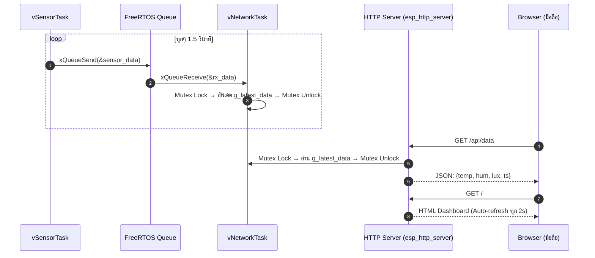

# ใบงานที่ 6.4: IoT Sensor Dashboard — แสดงผลค่าเซนเซอร์แบบ Real-Time ผ่าน Web Browser บนมือถือ

## 0. กล่าวนำ (Introduction)

ในใบงาน 6.3 นักศึกษาได้สร้างระบบ FreeRTOS Multi-Tasking ที่ `vSensorTask` อ่านค่าเซนเซอร์ → ส่งผ่าน Queue → `vNetworkTask` รับและ "เตรียม JSON" แต่ข้อมูลยังไม่ได้ออกไปสู่โลกภายนอก

ในใบงานนี้ นักศึกษาจะ**ต่อยอดโค้ด Lab 6-3 โดยตรง** โดยเพิ่ม
1. **ESP32 SoftAP** — ให้มือถือเชื่อมต่อ Wi-Fi ตรงโดยไม่ต้อง Router
2. **HTTP Web Server (`esp_http_server`)** — เปิด Endpoint 2 ตัว
   - `GET /` → หน้า Dashboard HTML Auto-refresh ทุก 2 วินาที
   - `GET /api/data` → ส่งค่า JSON ล่าสุดให้ Browser

---

## 1. วัตถุประสงค์ (Objectives)

1. เชื่อมโยง FreeRTOS Queue Pipeline กับ HTTP Web Server เพื่อส่งข้อมูลออกสู่ Browser จริง
2. ใช้งาน `esp_http_server` component ของ ESP-IDF ในการสร้าง REST API Endpoint บน ESP32
3. ออกแบบ ESP32 ให้ทำงานเป็น **SoftAP + HTTP Server** พร้อมกัน
4. เข้าใจการใช้ `SemaphoreHandle_t` (Mutex) เพื่อป้องกัน Race Condition เมื่อ HTTP Handler และ FreeRTOS Task แชร์ข้อมูลร่วมกัน

---

## 2. อุปกรณ์และซอฟต์แวร์ที่ใช้ในการทดลอง (Equipment & Tools)

1. บอร์ดไมโครคอนโทรลเลอร์ ESP32 จำนวน 1 บอร์ด
2. สายเชื่อมต่อ USB จำนวน 1 เส้น
3. สมาร์ตโฟนหรือ PC (สำหรับเปิด Browser ดู Dashboard)

---

## 3. สถาปัตยกรรมระบบ (System Architecture)



---

## 4. แนวคิดสำคัญ: Mutex ป้องกัน Race Condition

```
vNetworkTask                    HTTP GET Handler
─────────────────────────       ─────────────────────────
xSemaphoreTake(mutex)           xSemaphoreTake(mutex)
  g_latest_data = rx_data;         read g_latest_data
xSemaphoreGive(mutex)           xSemaphoreGive(mutex)
```

> [!WARNING]
> หากไม่ใช้ Mutex: HTTP Handler อาจอ่านข้อมูลขณะที่ `vNetworkTask` กำลังเขียนอยู่ ทำให้ได้ค่าที่ไม่สมบูรณ์ (Torn Read)

---

## 5. ซอร์สโค้ดการทดลอง (`main/main.c`)

ดูใน `ESP32_Project/Lab6-4-IoT-Sensor-Dashboard/main/main.c`

---

## 6. ขั้นตอนการทดลอง (Experimental Procedures)

1. Build และ Flash โค้ดลงบอร์ด ESP32
2. เปิด Serial Monitor ดู SSID และยืนยัน `[HTTP SERVER]: Started`
3. ใช้มือถือ **เชื่อมต่อ Wi-Fi ชื่อ `MY_ESP32_SENSOR_AP`** (Password: `12345678`)
4. เปิด Browser บนมือถือ แล้วไปที่ `http://192.168.4.1`
5. ควรเห็นหน้า Dashboard แสดง Temperature / Humidity / Light Lux และ Auto-refresh ทุก 2 วินาที
6. ทดสอบ JSON API โดยเปิด `http://192.168.4.1/api/data` ดู Raw JSON

ตัวอย่างหน้า browser


---

## 7. ตารางบันทึกผลการทดลอง (Experiment Results)

### 7.1 บันทึกข้อมูลจาก Dashboard

| ครั้งที่ | Temperature (°C) | Humidity (%) | Light Lux | Timestamp (ms) |
| :------: | :--------------: | :----------: | :-------: | :------------: |
|  **1**   |       26.1         |     52.9      | 549        |      218080          |
|  **2**   |       30.6           |  56.1            |     684      |      221100          |
|  **3**   |       32.9           |    51.1          |      317    |        103350        |

### 7.2 ทดสอบ JSON API (`/api/data`)

บันทึก Raw JSON Response จาก Browser:

```

{”temperature“:26.30,
”humidity“:66.00,
”light_lux“:561,
”timestamp_ms“:352460}

```


---

## 8. คำถามท้ายการทดลอง (Post-Lab Questions)

1. เหตุใดจึงต้องใช้ **Mutex** ในการป้องกันการเข้าถึงตัวแปร `g_latest_data` ร่วมกันระหว่าง `vNetworkTask` และ HTTP Handler? ถ้าไม่ใช้จะเกิดอะไรขึ้น?
~~~
ต้องใช้ Mutex เพื่อป้องกันปัญหา Race Condition ครับ เนื่องจาก vNetworkTask ทำหน้าที่ "เขียน" ข้อมูลใหม่ลงไป ส่วน HTTP Handler ทำหน้าที่อ่านข้อมูลออกไป
หากไม่ใช้ Mutex บล็อกเอาไว้ อาจเกิดเหตุการณ์ที่ HTTP Handler เข้ามาอ่านข้อมูลในจังหวะเดียวกับที่ vNetworkTask เขียนข้อมูลยังไม่เสร็จ ทำให้เกิดปัญหาที่เรียกว่า Torn Read
คือได้ข้อมูลครึ่งเก่าครึ่งใหม่ผสมกัน ทำให้หน้าเว็บหรือ JSON แสดงค่าที่ผิดเพี้ยนไป

~~~
2. `esp_http_server` รัน Handler บน Thread ใด — เป็น Thread เดียวกับ FreeRTOS Task ของเราหรือไม่?
~~~
ฟังก์ชัน esp_http_server ไม่ได้รัน บน Thread เดียวกับ vSensorTask หรือ vNetworkTask ของเราครับ เมื่อเราเรียกคำสั่ง httpd_start() ตัวเฟรมเวิร์ก ESP-IDF จะทำการสร้าง
FreeRTOS Task (Thread) ขึ้นมาใหม่เป็นเบื้องหลัง (Background Task) สำหรับจัดการกับ Web Server โดยเฉพาะ ดังนั้น HTTP Handler จึงทำงานอยู่บน Thread ของมันเอง
ทำให้เราต้องใช้ Mutex เพื่อแชร์ข้อมูลข้าม Thread อย่างปลอดภัย

~~~

3. การที่ Dashboard ใช้ `<meta http-equiv="refresh" content="2">` แทนที่จะใช้ JavaScript `fetch()` มีข้อดีและข้อเสียอย่างไร?
~~~
ข้อดี: เขียนโค้ดง่ายมากและสั้นกระชับ ไม่ต้องมีความรู้เรื่อง JavaScript หรือการเขียนโปรแกรมฝั่ง Frontend (Asynchronous) ก็สามารถทำให้หน้าเว็บอัปเดตตัวเองได้
ข้อเสีย: สิ้นเปลืองแบนด์วิดท์ (Bandwidth) และทรัพยากรของ ESP32 มาก เพราะทุกๆ 2 วินาที บราวเซอร์จะต้องดาวน์โหลดหน้าเว็บเพจทั้งหน้าใหม่ทั้งหมด (รวมถึงแท็ก HTML ต่างๆ) นอกจากนี้ยังทำให้เกิดประสบการณ์
การใช้งานที่ไม่ดี (UX แย่) เพราะหน้าจอจะกระพริบ (Flicker) สีขาวทุกครั้งที่รีเฟรช ต่างจากการใช้ JavaScript fetch() ที่จะดึงเฉพาะข้อมูล JSON มาอัปเดตแค่ตัวเลข โดยที่หน้าเว็บไม่ต้องโหลดใหม่

~~~
---

## 9. ความรู้เพิ่มเติม: ESP-IDF `esp_http_server` API

| ฟังก์ชัน                                   | ความหมาย                                     |
| :----------------------------------------- | :------------------------------------------- |
| `httpd_start(&server, &config)`            | เริ่มต้น HTTP Server (เปิด Port 80)          |
| `httpd_register_uri_handler(server, &uri)` | ลงทะเบียน Handler สำหรับ URL path            |
| `httpd_resp_send(req, buf, len)`           | ส่ง Response กลับไปยัง Browser               |
| `httpd_resp_set_type(req, type)`           | กำหนด Content-Type (เช่น `application/json`) |
| `xSemaphoreCreateMutex()`                  | สร้าง Mutex สำหรับป้องกัน Race Condition     |
| `xSemaphoreTake(mutex, ticks)`             | Lock Mutex ก่อนอ่าน/เขียน Shared Data        |
| `xSemaphoreGive(mutex)`                    | Unlock Mutex หลังเสร็จ                       |
